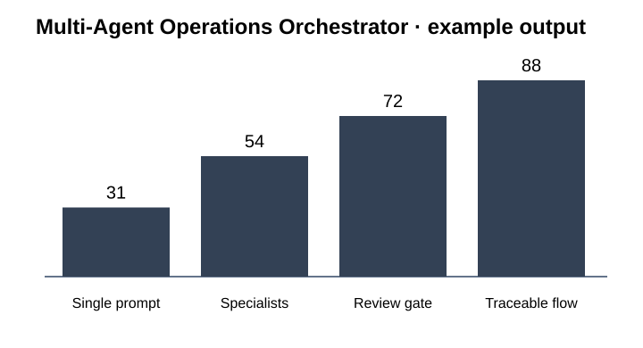

# SC-02 · Multi-Agent Operations Orchestrator

**A controlled multi-agent system that separates planning, specialist work, review and execution.**

**Designed for:** Operations · internal tooling · cross-functional workflows

## Why this project matters

- Break complex work into accountable specialist stages
- Keep delegation and hand-offs visible
- Insert independent review before material actions
- Persist workflow state across agent boundaries

A business reviewer can stay on this page. A technical reviewer can move directly to the [technical implementation](technical/README.md).

## Example operating flow

```text
Business request
    ↓
    Planner
        ↓
        Specialist agents
            ↓
            Reviewer
                ↓
                Approval
                    ↓
                    Executor
                        ↓
                        Audit
```

## Technology at a glance

**Python · FastAPI · LangGraph · PostgreSQL · Redis · Docker · OpenAI · Anthropic · Pydantic**

The stack is shown early because technical fit matters. The project is still explained in business terms first.

## What is included

- [Business impact and KPIs](docs/BUSINESS_IMPACT.md)
- [Example results and how to read them](docs/RESULTS.md)
- [Architecture](docs/ARCHITECTURE.md)
- [Technical decisions](docs/TECHNICAL_DECISIONS.md)
- [Data and public sample structure](docs/DATA.md)
- [Security and permissions](docs/SECURITY_AND_PERMISSIONS.md)
- [Credentials and integrations](docs/CREDENTIALS_AND_INTEGRATIONS.md)
- [Environments](docs/ENVIRONMENTS.md)
- [Limitations](docs/LIMITATIONS.md)
- [Example inputs, outputs and logs](examples/README.md)
- [Technical implementation, SQL and tests](technical/README.md)

## What the example data represents

Workflow state, agent messages, review outcomes and execution events for representative operational tasks.

The repository does not contain client credentials or confidential records.

## Visual evidence



## Main technical execution

**Start with [`technical/run_project.py`](technical/run_project.py).** This is the principal end-to-end code path for the public implementation.

## Local review

The public implementation is designed so that the core example can be inspected locally without production credentials. Tool-specific connectors are configured through environment variables and are documented separately.

[Open the technical implementation →](technical/README.md)
