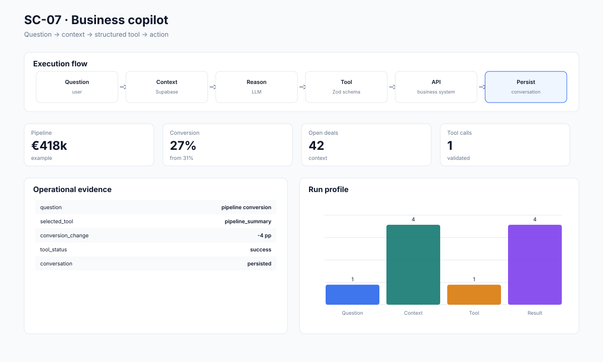

# SC-07 · Full-Stack LLM Business Copilot

**A full-stack web application that combines conversational analysis, structured tools and persistent business context.**

**Designed for:** Internal analytics · operations · SaaS products · decision support

## Why this project matters

- Give users one interface for questions and actions
- Keep tool calls structured and reviewable
- Persist conversations and results
- Support a real product experience rather than a standalone prompt

A business reviewer can stay on this page. A technical reviewer can move directly to the [technical implementation](technical/README.md).

## Example operating flow

```text
User question
    ↓
    Context retrieval
        ↓
        LLM reasoning
            ↓
            Structured tool call
                ↓
                Business API
                    ↓
                    Result
                        ↓
                        Persistent conversation
```

## Technology at a glance

**Next.js · TypeScript · React · PostgreSQL · Supabase · OpenAI · Vercel · Zod · Tailwind CSS**

The stack is shown early because technical fit matters. The project is still explained in business terms first.

## What is included

- [Business impact and KPIs](docs/BUSINESS_IMPACT.md)
- [Example results and how to read them](docs/RESULTS.md)
- [Architecture](docs/ARCHITECTURE.md)
- [Technical decisions](docs/TECHNICAL_DECISIONS.md)
- [Data and public sample structure](docs/DATA.md)
- [Security and permissions](docs/SECURITY_AND_PERMISSIONS.md)
- [Credentials and integrations](docs/CREDENTIALS_AND_INTEGRATIONS.md)
- [Environments](docs/ENVIRONMENTS.md)
- [Limitations](docs/LIMITATIONS.md)
- [Example inputs, outputs and logs](examples/README.md)
- [Technical implementation, SQL and tests](technical/README.md)

## What the example data represents

Representative conversation history, structured tool inputs, tool results and user-visible response state.

The repository does not contain client credentials or confidential records.

## Visual evidence



## Main technical execution

**Start with [`technical/run_project.ts`](technical/run_project.ts).** This is the principal end-to-end code path for the public implementation.

## Local review

The public implementation is designed so that the core example can be inspected locally without production credentials. Tool-specific connectors are configured through environment variables and are documented separately.

[Open the technical implementation →](technical/README.md)
