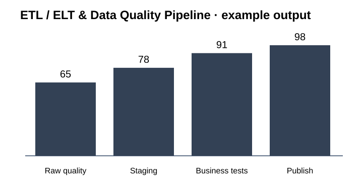

# SC-09 · ETL / ELT & Data Quality Pipeline

**A reproducible analytics-engineering pipeline with SQL transformations and explicit quality gates.**

**Designed for:** Analytics teams · reporting · ML feature preparation · finance data

## Why this project matters

- Catch broken data before it reaches decisions
- Make transformations reviewable
- Separate raw, staging and business-ready layers
- Automate build and test steps

A business reviewer can stay on this page. A technical reviewer can move directly to the [technical implementation](technical/README.md).

## Example operating flow

```text
Raw files
    ↓
    Schema validation
        ↓
        dbt staging
            ↓
            Business tests
                ↓
                Mart build
                    ↓
                    Publish
```

## Technology at a glance

**dbt · DuckDB · Python · Pandera · Parquet · Apache Airflow · SQL · Docker · GitHub Actions**

The stack is shown early because technical fit matters. The project is still explained in business terms first.

## What is included

- [Business impact and KPIs](docs/BUSINESS_IMPACT.md)
- [Example results and how to read them](docs/RESULTS.md)
- [Architecture](docs/ARCHITECTURE.md)
- [Technical decisions](docs/TECHNICAL_DECISIONS.md)
- [Data and public sample structure](docs/DATA.md)
- [Security and permissions](docs/SECURITY_AND_PERMISSIONS.md)
- [Credentials and integrations](docs/CREDENTIALS_AND_INTEGRATIONS.md)
- [Environments](docs/ENVIRONMENTS.md)
- [Limitations](docs/LIMITATIONS.md)
- [Example inputs, outputs and logs](examples/README.md)
- [Technical implementation, SQL and tests](technical/README.md)

## What the example data represents

Representative Parquet/CSV inputs, validated staging data, dbt models, test outcomes and curated marts.

The repository does not contain client credentials or confidential records.

## Visual evidence



## Main technical execution

**Start with [`technical/run_project.py`](technical/run_project.py).** This is the principal end-to-end code path for the public implementation.

## Local review

The public implementation is designed so that the core example can be inspected locally without production credentials. Tool-specific connectors are configured through environment variables and are documented separately.

[Open the technical implementation →](technical/README.md)
