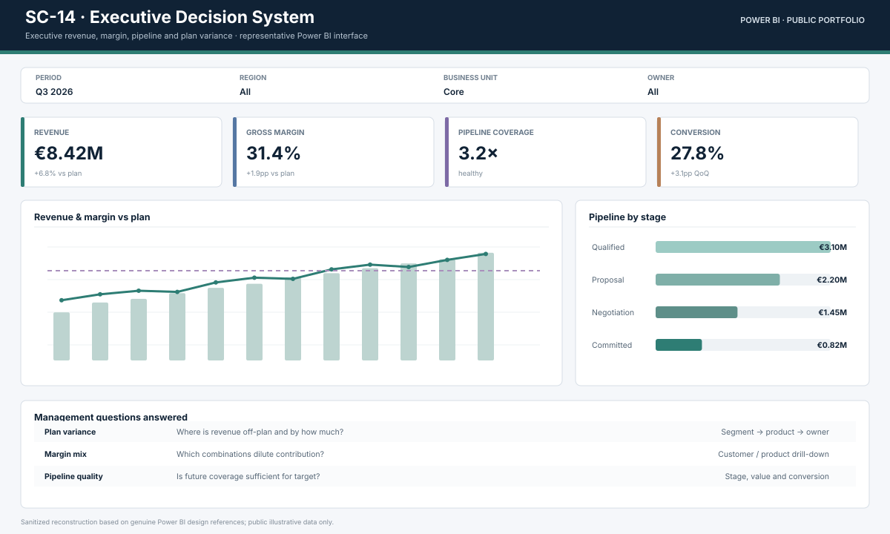

# SC-14 · Power BI Executive Decision System

**A semantic-model-driven executive reporting system for revenue, margin, pipeline and operating performance.**

**Designed for:** Management · finance · sales · operations

## Business impact

- Create one KPI definition layer across teams
- Move from static reporting to drillable management questions
- Connect commercial and financial performance in one model
- Make period and segment comparisons repeatable

## Technology at a glance

**Power BI · DAX · Power Query · SQL · Star Schema · PostgreSQL · Excel**

## What is complete

- business context and KPI definition
- data model and source preparation
- SQL assets
- credentials and integration documentation
- environment guidance
- tests for the public datasource
- tool-specific calculations and model specification
- local data preparation scripts

## Native visual layer

The Power BI screenshot set is the only intentionally pending layer. It will be added from a native-tool visual reference rather than fabricated.

## Visual evidence

This visual documents the analytical/model structure. The native BI screenshot layer remains pending until the real tool reference is supplied.

## Main technical execution

**Start with [`technical/run_project.py`](technical/run_project.py).** This is the principal end-to-end code path for the public implementation.

## Technical review

- [Architecture](docs/ARCHITECTURE.md)
- [Results and KPI interpretation](docs/RESULTS.md)
- [Data](docs/DATA.md)
- [Technical decisions](docs/TECHNICAL_DECISIONS.md)
- [Security and permissions](docs/SECURITY_AND_PERMISSIONS.md)
- [Credentials and integrations](docs/CREDENTIALS_AND_INTEGRATIONS.md)
- [Technical implementation](technical/README.md)
