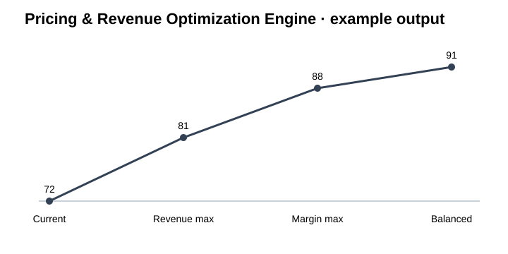

# SC-21 · Pricing & Revenue Optimization Engine

**A pricing system combining demand response, margin economics and constrained scenario optimization.**

**Designed for:** E-commerce · SaaS · marketplaces · hospitality

## Why this project matters

- Quantify price-demand trade-offs
- Compare scenarios before rollout
- Respect floor prices and margin targets
- Optimize contribution rather than revenue alone

A business reviewer can stay on this page. A technical reviewer can move directly to the [technical implementation](technical/README.md).

## Example operating flow

```text
Price history
    ↓
    Elasticity estimation
        ↓
        Demand response
            ↓
            Scenario generation
                ↓
                Constraints
                    ↓
                    Optimization
                        ↓
                        Recommended price
```

## Technology at a glance

**Python · Pandas · NumPy · SciPy · Statsmodels · XGBoost · Optuna · FastAPI · Plotly**

The stack is shown early because technical fit matters. The project is still explained in business terms first.

## What is included

- [Business impact and KPIs](docs/BUSINESS_IMPACT.md)
- [Example results and how to read them](docs/RESULTS.md)
- [Architecture](docs/ARCHITECTURE.md)
- [Technical decisions](docs/TECHNICAL_DECISIONS.md)
- [Data and public sample structure](docs/DATA.md)
- [Security and permissions](docs/SECURITY_AND_PERMISSIONS.md)
- [Credentials and integrations](docs/CREDENTIALS_AND_INTEGRATIONS.md)
- [Environments](docs/ENVIRONMENTS.md)
- [Limitations](docs/LIMITATIONS.md)
- [Example inputs, outputs and logs](examples/README.md)
- [Technical implementation, SQL and tests](technical/README.md)

## What the example data represents

Representative price, demand, promotion, margin and product-context data with candidate price scenarios.

The repository does not contain client credentials or confidential records.

## Visual evidence



## Main technical execution

**Start with [`technical/run_project.py`](technical/run_project.py).** This is the principal end-to-end code path for the public implementation.

## Local review

The public implementation is designed so that the core example can be inspected locally without production credentials. Tool-specific connectors are configured through environment variables and are documented separately.

[Open the technical implementation →](technical/README.md)
